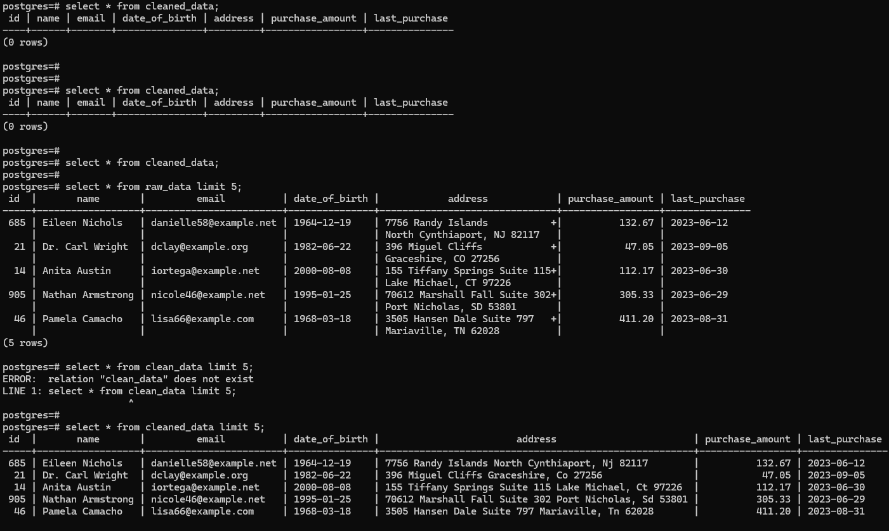

# DE_challenge_falabella

Librerías necesarias para ejecutar:

`pip install psycopg2` `pip install pandas` `pip install Faker`

Se realizaron las pruebas bajo Python v3.7.7 y el código principal se ejecuta desde el módulo [processing/clean_data.py](processing/clean_data.py).

La información trabajada fue almacenada sobre PostgreSQL 15.4, las sentencias previas para preconfigurar la base de datos están en el archivo [sql_statementss.sql](sql_statements.sql).

La data para la tabla _raw_data_ se cargó automáticamente con la librería **Faker**, facilitando la prueba y ayudando a el refresco de las pruebas con distinta información.

El flujo de ejecución del programa se detalla en el siguiente diagrama:

Algunos ejemplos de ejecucion del código main:

Ejecución de tablas antes y después.

